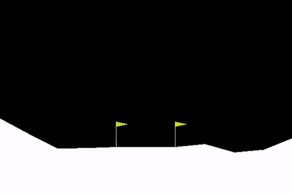

# Lunar Lander

CS7642 Project 2: OpenAI’s Lunar Lander problem, an 8-dimensional state space and 4-dimensional action space problem. The goal was to create an agent that can guide a space vehicle to land autonomously in the environment without crashing. 

This is an implementation of Double Deep Q-learning with experience replay trained with 5000 epochs.

## Installation

`pip install keras gym[all] numpy`

## Usage

- main.py is the reinforcement learning agent
  - Run `python main.py` to start training the agent
  - Set `viewOnly = True` to load saved neural network weights and render results from trained agent

## Notes

- Trained agent model is saved in the weights/ directory as trained_agent.h5
- Trained agent result (reward vs episode) is saved in the results/ directory as trained_agent.txt
- Hyperparameter search results (reward vs episode) is saved in the results/ directory as files in alpha search and gamma search
- Performance graphs are found in the graphs/ directory